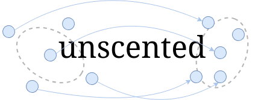

A flexible and powerful unscented Kalman filter library (C++11 or later) that makes no assumptions about what you're estimating or how you're measuring it.

## Table of contents
* [What is an unscented Kalman filter?](#what-is-an-unscented-kalman-filter)
* [Features](#features)
* [Installation](#installation)
* [Examples](#examples)
	* [Airplane tracking](#airplane-tracking)
	* [Robot localization](#robot-localization)
	* [Orientation estimation](#orientation-esitmation)
* [Background](#background)
	* [Random variables](#random-variables) 
	* [The Kalman filter](#the-kalman-filter)
	* [The unscented transformation](#the-unscented-transformation)
	* [The unscented Kalman filter](#the-unscented-kalman-filter)
* [License and contributing](#license-and-contributing)

## What is an unscented Kalman filter?

## Features

## Installation

## Examples

### Airplane tracking

### Robot localization

### Orientation estimation

## Background

### Random variables

### The Kalman filter

### The unscented transformation

#### Why "unscented"?

Jeffrey Uhlmann, the creator of the unscented transformation, was a humble guy that didn't want his name attached to his invention. Uhlmann [arbitrarily picked the name](https://medium.com/@anthony_sarkis/what-is-a-kalman-filter-and-why-is-there-an-unscented-version-bc5f6e77c509) *unscented* transformation from a stick of unscented deodorant on his colleague's desk. It was chosen in part to test Uhlmann's theory that people simply accept technical terms without much thought (it turns out he was right in this case). Afterwards, a running joke was made that the term was selected because the previously established nonlinear extension to the Kalman filter (the aptly named [extended Kalman filter](https://en.wikipedia.org/wiki/Kalman_filter#Extended_Kalman_filter)) had *stinky* performance, unlike the new unscented approach.

### The unscented Kalman filter

## License and contributing
